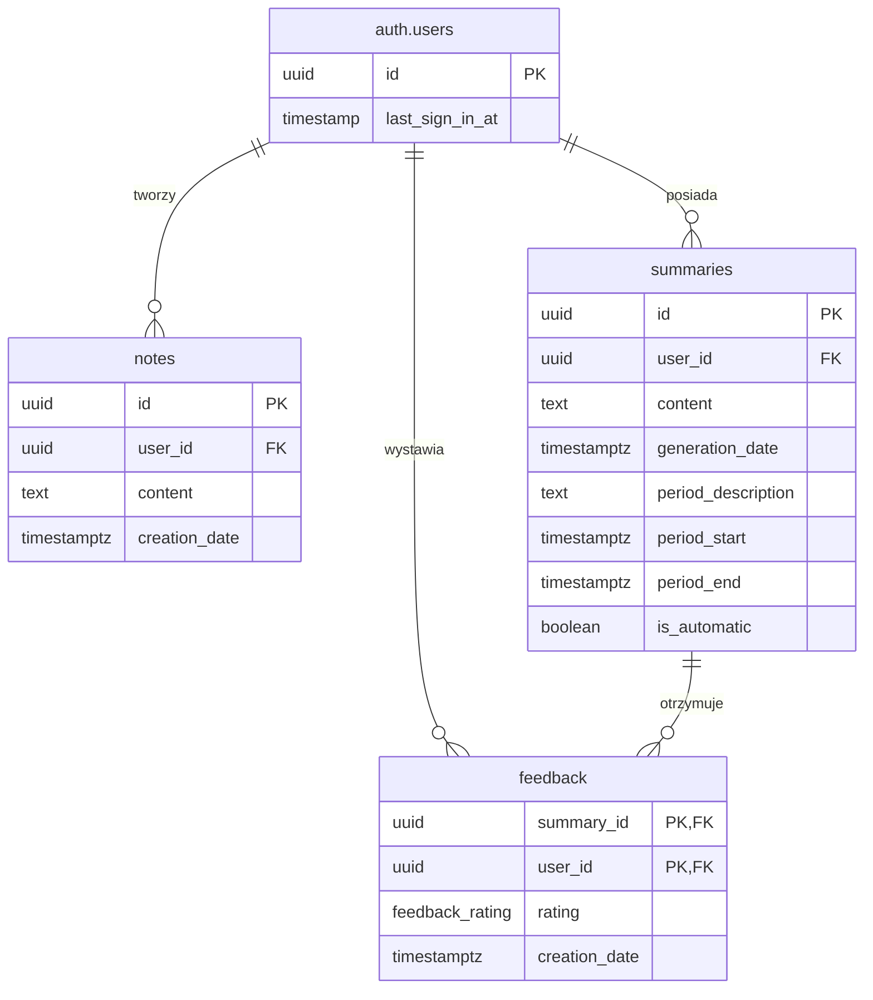

# Relacje między tabelami

## Diagram ERD

## Opis relacji

### auth.users -> notes (1:M)
- Jeden użytkownik może mieć wiele notatek
- Relacja realizowana przez klucz obcy `user_id` w tabeli `notes`
- `ON DELETE CASCADE` - usunięcie użytkownika kasuje jego notatki

### auth.users -> summaries (1:M)
- Jeden użytkownik może mieć wiele podsumowań
- Relacja realizowana przez klucz obcy `user_id` w tabeli `summaries`
- `ON DELETE CASCADE` - usunięcie użytkownika kasuje jego podsumowania

### auth.users -> feedback (1:M)
- Jeden użytkownik może wystawić wiele ocen (dla różnych podsumowań)
- Relacja realizowana przez klucz obcy `user_id` w tabeli `feedback`
- `ON DELETE CASCADE` - usunięcie użytkownika kasuje jego oceny

### summaries -> feedback (1:1)
- Jedno podsumowanie może mieć jedną ocenę od danego użytkownika
- Relacja realizowana przez klucz obcy `summary_id` w tabeli `feedback`
- Klucz główny tabeli `feedback` składa się z pary (`summary_id`, `user_id`)
- `ON DELETE CASCADE` - usunięcie podsumowania kasuje jego oceny